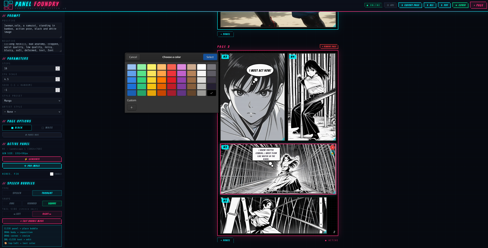

# Panel Foundry
### Comic Creation System — v8

A browser-based comic book creation tool that generates panel artwork through a local **Stable Diffusion Forge** (SD-Forge / Forge Neo) instance. Design multi-page comic layouts, generate AI images per panel, add speech bubbles, and export to PNG or PDF — all from a single HTML file with no installation required.

---

## Screenshots

**Cover page — full-bleed panel with generated artwork**


**Multi-panel story page with snap-to-grid layout**


**Text Bubble Feature**


---

## Features

### Pages & Layout
- **Standard comic page size** — pages are fixed at the standard 6.625" × 10.25" comic book format (520 × 800px display canvas)
- **Cover Page** — dedicated cover button creates a full-bleed single-panel page, labelled separately from the numbered page sequence
- **Multiple pages** — add and remove as many pages as needed; click a page to make it the **active page** for export
- **Page numbers** — non-cover pages display a page number in the lower-right corner, visible in exports
- **Gap fill color** — set the background space between panels to black or white per project

### Panels
- **Free placement** — drag panels anywhere within the page boundary
- **10px snap-to-grid** — panels snap to a 10px grid with a minimum 10px gutter from the page edge, making clean alignment easy
- **Resize** — drag the bottom-right corner of any panel to resize it; generation always uses the current live panel size
- **Panel numbers** — each panel gets a sequential `#N` badge (global across all pages); toggle visibility with the `# PANEL NOS` button
- **Panel lock** — 🔓/🔒 button inside each panel locks it in place, preventing accidental movement or resizing
- **Pan image** — after generating, use **✥ PAN IMAGE** mode to drag the image within the panel frame for precise cropping
- **Add / Remove** — the `+` button below each page adds panels; the `−` button inside each panel removes it (with confirmation)

### Image Generation
- **SD-Forge API** — connects to a local SD-Forge instance via the `/sdapi/v1/txt2img` endpoint
- **Configurable URL** — set your SD-Forge base URL, sampler, and optional model checkpoint override via the ⚙ API config panel
- **Dynamic sizing** — generation dimensions are derived from the panel's current display size, snapped to the nearest SD-valid resolution (multiples of 8, clamped to 64–2048px)
- **Parameters** — Steps, CFG Scale, Seed, Style Preset, and Artist Style all feed directly into the prompt
- **Style Presets** — Comic Book, Manga, Watercolor, Retro 50s, Noir, Cyberpunk
- **Artist Styles** — 30 comic book artists including Jack Kirby, Frank Miller, Jim Lee, Alex Ross, Mike Mignola, Todd McFarlane, Dave Gibbons, and more — each with a detailed style prompt suffix

#### Hires. Fix

Hires. Fix enables high-quality upscaling by generating a smaller base image first, then refining it to the target resolution. This produces significantly better results than generating at large sizes directly, because SDXL and SD 1.5 models degrade in compositional quality above their native training resolution.

**How base size is calculated:**

When Hires. Fix is enabled, the panel's full SD resolution is **halved** for the base generation pass. The upscale multiplier then brings the result back up to (or beyond) the original target:

| Panel target | Base gen (÷2) | Multiplier | Hires output |
|---|---|---|---|
| 1024 × 1024 | 512 × 512 | ×2 | 1024 × 1024 |
| 1024 × 768 | 512 × 384 | ×2 | 1024 × 768 |
| 768 × 1024 | 384 × 512 | ×2 | 768 × 1024 |
| 1024 × 1024 | 512 × 512 | ×2.5 | 1280 × 1280 |

The sidebar shows all three steps in real time: **PANEL TARGET → BASE GEN (÷2) → HIRES OUT (×N)**, so the math is always transparent before you generate.

**SD-Forge API parameters used (confirmed working, issue #2680):**

| Parameter | Notes |
|---|---|
| `enable_hr: true` | Correct Forge field — not `hires_fix` |
| `hr_scale` | Multiplier only — `hr_resize_x/y` are NOT sent (they conflict) |
| `hr_upscaler` | Latent, ESRGAN_4x, R-ESRGAN 4x+, R-ESRGAN Anime6B, SwinIR_4x |
| `hr_second_pass_steps` | Separate step count for the upscale pass |
| `denoising_strength` | Must be > 0 or no refinement occurs (0.3–0.6 recommended) |
| `hr_additional_modules` | Required by Forge — defaults to `["Use same choices"]` |
| `hr_sampler_name` | Optional — omitted when set to "Use same sampler" |

> **Note:** Hires. Fix applies to SD 1.5 and SDXL models. Flux-based models in Forge Neo use a different native high-res workflow and do not use these parameters.

### Speech Bubbles
- **Types** — Speech (with directional tail) and Thought (with directional dot trail)
- **Shapes** — Oval, Rounded Rectangle, Square — applies to both types
- **Tail direction** — Left or Right for both Speech tails and Thought dot trails
- **Seamless tails** — Speech bubble tails are drawn as a single continuous SVG path, not a separate object
- **Thought bubbles** — three ascending dots trail toward the chosen direction, classic comics convention
- **Resizable** — drag the corner of any bubble to resize; text auto-scales to fit
- **Draggable** — drag the bubble body to reposition within the panel
- **Text editing** — double-click any bubble to edit text inline; Enter to confirm
- **Text color** — click the 🎨 dot (top-left of bubble on hover) to open a color picker
- **Delete** — hover a bubble and click ✕ to remove it
- **Isolated mode** — Place Bubble mode is fully separate from panel movement; all panel drag and selection is suspended while placing bubbles

### Export

| Button | What it does |
|---|---|
| **⬇ EXPORT PAGE** | Exports the currently active page (click a page to select it) as a PNG |
| **⬇ ALL** | Exports every page as individual PNG files, sequentially downloaded |
| **⬇ PDF** | Builds a single PDF at comic page dimensions — covers first, then pages in order |

All exports strip UI chrome: page borders, grid overlay, panel selection highlights, toolbar buttons, and the `+ PANEL` button. Panel number badges export only if the `# PANEL NOS` toggle is on. Page number badges always export on non-cover pages.

PDF output uses jsPDF and produces a print-ready file at **6.625" × 10.25"** (477pt × 738pt) per page, with pages ordered cover-first then sequentially by page number.

---

## Requirements

- A modern browser (Chrome or Edge recommended for best html2canvas export support)
- A running **SD-Forge** or **SD-Forge Neo** instance with the API enabled
- SD-Forge must be launched with `--api` and `--cors-allow-origins=*` (or your specific browser origin)

### SD-Forge launch flags

```
webui.bat --api --cors-allow-origins=*
```

---

## Installation

No installation needed. It is a single self-contained HTML file.

1. Download `index.html`
2. Open it in your browser
3. Click **⚙ API** and enter your SD-Forge URL (default: `http://127.0.0.1:7860`)
4. Click **Test** to confirm the connection
5. Click **+ PAGE** or **★ COVER** to start your comic

---

## Supported SD Image Sizes

Panels snap to the nearest valid SD resolution when generating. For custom panel sizes, the app automatically snaps to the nearest multiple of 8 within the 64–2048px range.

| Size | Label |
|---|---|
| 512 × 512 | Square |
| 512 × 768 | Portrait |
| 768 × 512 | Landscape |
| 768 × 768 | Square L |
| 512 × 1024 | Tall |
| 1024 × 512 | Wide |
| 768 × 1024 | Portrait L |
| 1024 × 768 | Landscape L |

When **Hires. Fix** is enabled, these values are halved for the base generation pass and the multiplier brings them back up. The sidebar always shows what will actually be sent to the API before you click Generate.

---

## Workflow

```
1.  Click ★ COVER → creates a full-page cover panel
2.  Write a prompt, pick a style/artist → ⚡ GENERATE
3.  Click + PAGE → add story pages
4.  Click + PANEL below a page → pick a size → panel appears on the page
5.  Drag panels to position them; drag corners to resize
6.  Select a panel → write a prompt → ⚡ GENERATE
7.  For large panels: enable Hires. Fix → set multiplier → ⚡ GENERATE
      Base gen is halved, upscaled back up — better quality at large sizes
8.  ✥ PAN IMAGE → drag the image within the frame to crop it how you want
9.  ✏ PLACE BUBBLE → click inside a panel → choose type/shape/tail → type text
10. Click a page to make it active → ⬇ EXPORT PAGE (PNG)
11. ⬇ ALL → exports every page as individual PNGs
12. ⬇ PDF → exports the full comic in order as a single print-ready PDF
```

---

## Keyboard Shortcuts

| Action | How |
|---|---|
| Confirm bubble text | `Enter` |
| New line in bubble | `Shift + Enter` |
| Exit text edit | Click outside or `Enter` |

---

## Project Structure

```
panel-foundry/
├── index.html      # The entire application — HTML, CSS, and JS in one file
├── README.md       # This file
├── LICENSE         # MIT License
└── screenshots/    # Add your own screenshots here
```

---

## Version History

| Version | Highlights |
|---|---|
| v1 | Initial build — panel layout, SD-Forge API, basic speech bubbles |
| v2 | Page-based layout, draggable bubble tail pointer |
| v3 | Fixed comic page size (520×800), free panel movement, panel numbers |
| v4 | Image panning, hide panel numbers toggle, dynamic gen size, 30 artist styles |
| v5 | Persistent `−` delete button, panel lock, snap-to-grid, clean export |
| v6 | Thought/Speech bubble redesign, cover page, Hires. Fix initial implementation |
| v6.1 | Corrected Hires. Fix API — `enable_hr`, `hr_additional_modules`, `hr_sampler_name`; removed conflicting `hr_resize_x/y` |
| v7 | `+ PANEL` button moved outside page frame, page numbers in export, bubble mode fully isolated, active-page export, Export All PNG, Export PDF |
| v8 | Hires. Fix base gen halved (÷2) before upscale — better quality at large panel sizes; live size preview shows full pipeline |

---

## Known Limitations

- **Export uses html2canvas** — SVG speech bubbles and CSS effects render correctly in most cases, but complex shapes may not capture perfectly in all browsers. Chrome and Edge give the most reliable results.
- **Hires. Fix + Flux** — Hires. Fix is a traditional SD 1.x/SDXL feature. Flux-based models in Forge Neo use a different native high-res workflow and the hires parameters will be silently ignored by the backend.
- **CORS** — If the browser blocks API calls to your local SD-Forge instance, make sure Forge is launched with `--cors-allow-origins=*`.
- **Panel resize** — The browser's native `resize: both` CSS property is used for panel resizing. Behaviour may differ slightly between browsers; Chrome gives the most consistent experience.
- **Export All downloads** — Browsers may prompt to allow multiple file downloads. Allow them when asked.
- **PDF file size** — JPEG compression at 93% quality is used for PDF pages. Very large panels at high multipliers will produce larger PDF files.

---

## License

MIT — free to use, modify, and distribute. See `LICENSE` for full text.

---

## Acknowledgements

- [Stable Diffusion WebUI Forge](https://github.com/lllyasviel/stable-diffusion-webui-forge) by lllyasviel
- [Forge Neo](https://github.com/Haoming02/sd-webui-forge-classic) by Haoming02
- [html2canvas](https://html2canvas.hertzen.com/) for page capture
- [jsPDF](https://github.com/parallax/jsPDF) for PDF export
- Fonts: [Bangers](https://fonts.google.com/specimen/Bangers), [Orbitron](https://fonts.google.com/specimen/Orbitron), [Share Tech Mono](https://fonts.google.com/specimen/Share+Tech+Mono) via Google Fonts
